# rsschool-devops-course-tasks


<details>
<summary>Task 1: AWS Account Configuration</summary>

 https://github.com/rolling-scopes-school/tasks/blob/master/devops/modules/1_basic-configuration/task_1.md

This repository contains Terraform configurations for automating AWS infrastructure using GitHub Actions.

## Prerequisites

- **AWS CLI v2**
- **Terraform v1.6+**
- **AWS Account with sufficient IAM permissions**
- **GitHub repository with secrets configured for AWS_REGION, AWS_ROLE_TO_ASSUME, and TERRAFORM_VERSION**

## Setup

### Steps

1. **Clone the Repository:**
   ```bash
   git clone https://github.com/Tati-Moon/rsschool-devops-course-tasks.git
   cd rsschool-devops-course-tasks
   ```

### 2. Configure AWS CLI
Ensure that your AWS CLI is properly configured with the necessary credentials. You will need the `Access Key ID` and `Secret Access Key` for the IAM user with sufficient permissions.

Run the following command to configure AWS CLI:

```bash
aws configure
```

Follow the prompts to enter:
- `AWS Access Key ID`: Your IAM user's access key.
- `AWS Secret Access Key`: Your IAM user's secret key.
- `Default region name`: Enter the AWS region where you want to deploy your infrastructure (e.g., `eu-central-1`).
- `Default output format`: You can specify `json`, or leave this blank for default formatting.

Once configured, verify that AWS CLI is working correctly by running:

```bash
aws sts get-caller-identity
```

### 3. Setup GitHub Secrets
To securely pass sensitive information to GitHub Actions, you need to configure repository secrets in your GitHub project.

Go to your repository on GitHub:
1. Navigate to **Settings** > **Secrets and variables** > **Actions**.
2. Click **New repository secret** and add the following secrets:
   - `AWS_REGION`: The AWS region where your infrastructure is deployed (e.g., `eu-central-1`).
   - `AWS_ROLE_TO_ASSUME`: The IAM role to assume for GitHub Actions (e.g., `arn:aws:iam::000000000000:role/GithubActionsRole`).
   - `TERRAFORM_VERSION`: The Terraform version you want to use (e.g., `1.6.0`).

### 4. Run GitHub Actions Workflow
Once you've set up AWS CLI and GitHub secrets, you can trigger the GitHub Actions workflow.

- **Push to the `main` branch** or **create a pull request** to trigger the automated workflow, which will run Terraform commands to deploy your infrastructure on AWS.

You can view the workflow progress in the **Actions** tab of your GitHub repository.

### 5. Monitor Terraform Output
During the GitHub Actions run, Terraform will:
- **Initialize** the configuration and backend (S3 bucket for storing state).
- **Plan** the changes to the infrastructure.
- **Apply** those changes automatically to create or update AWS resources.

### 6. Check the AWS Console
Once the workflow completes successfully, you can visit the AWS Management Console to verify the deployed resources, such as the S3 bucket and IAM roles.

## Inputs

- `aws_region`: The AWS region where resources will be deployed (default: `eu-central-1`).
- `task_bucket_name`: The name of the S3 bucket to be created (default: `tati.task1-new-bucket`).

## Outputs

- `new_bucket_name`: The name of the newly created S3 bucket.
- `github_actions_role_arn`: The ARN of the IAM role created for GitHub Actions.

## Troubleshooting

### Common Errors

1. **Access Denied (403)**:
   - Check that the IAM role and user have the correct permissions.
   - Verify that OIDC provider is correctly configured in AWS to trust GitHub Actions.
   
2. **Terraform Backend Issues**:
   - Ensure the S3 bucket for Terraform state exists and is properly configured.
   - Make sure the bucket has encryption enabled and the correct permissions.

### Design Choices

- **Remote State**: S3 is used for storing Terraform state to ensure that infrastructure changes are tracked and consistent across multiple users or automated workflows.
- **IAM Role with OIDC**: This design eliminates the need for long-lived AWS credentials by allowing GitHub Actions to assume an AWS role via OpenID Connect (OIDC), providing a more secure and modern authentication approach.

## Project steps:

### 1. Installed AWS CLI and Terraform
- Followed the instructions to install **AWS CLI 2**.
- Followed the instructions to install **Terraform 1.6+**.
- **Optional:** Configured Terraform version manager **tfenv**.

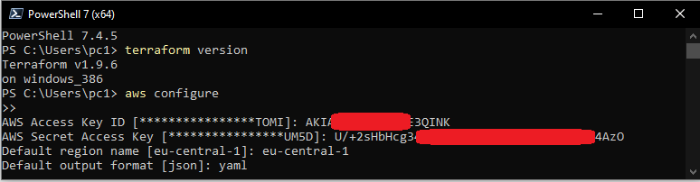

### 2. Created IAM User and Configured MFA
- Navigated to IAM in the AWS account and created a new user with the following policies attached:
  - **AmazonEC2FullAccess**
  - **AmazonRoute53FullAccess**
  - **AmazonS3FullAccess**
  - **IAMFullAccess**
  - **AmazonVPCFullAccess**
  - **AmazonSQSFullAccess**
  - **AmazonEventBridgeFullAccess**
- Configured MFA for both the new user and the root user.
- Generated a new pair of **Access Key ID** and **Secret Access Key** for the user.


### 3. Configured AWS CLI
- Configured AWS CLI to use the new user's credentials.
- Verified the configuration by running the command: 
  ```bash
  aws ec2 describe-instance-types --instance-types t4g.nano
  ```
### 4. Created a GitHub Repository for Terraform Code
- Utilized a personal GitHub account to create a repository named **rsschool-devops-course-tasks**. This repository served as the central location for storing and managing the Terraform configuration files.

### 5. Created a Bucket for Terraform States
- Established a dedicated S3 bucket to manage Terraform state files, adhering to best practices for state management. The S3 bucket was configured as the backend for storing the Terraform state, ensuring secure and efficient tracking of infrastructure changes.

### 6. Created an IAM Role for GitHub Actions
- Created an IAM role named **GithubActionsRole**, assigning it the same permissions as the previously created IAM user in step 2. The attached policies included:
  - **AmazonEC2FullAccess**
  - **AmazonRoute53FullAccess**
  - **AmazonS3FullAccess**
  - **IAMFullAccess**
  - **AmazonVPCFullAccess**
  - **AmazonSQSFullAccess**
  - **AmazonEventBridgeFullAccess**
  
  This role enabled GitHub Actions to perform operations on AWS resources securely.

  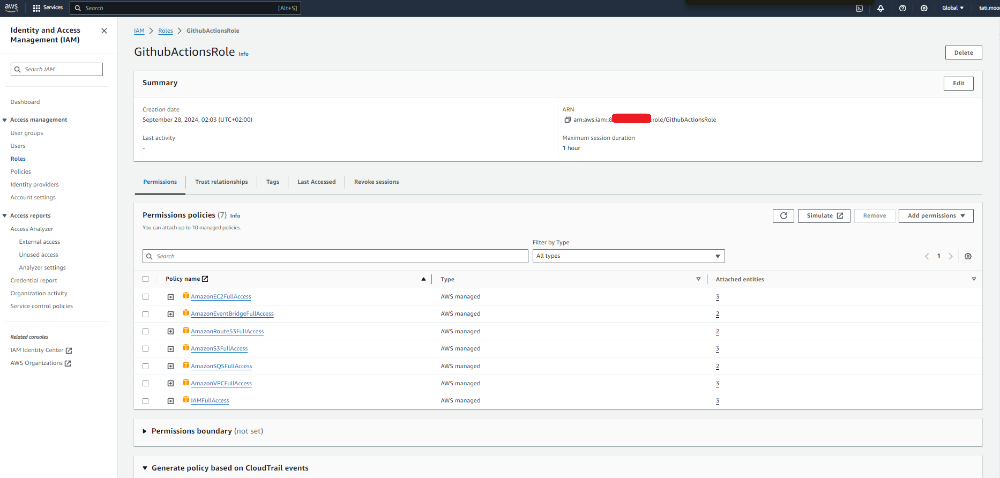

### 7. Configured an Identity Provider and Trust Policies for GitHub Actions
- Updated the **GithubActionsRole** IAM role to include a Trust policy that allows GitHub Actions to assume the role. This configuration was based on guidance from:
  - [IAM Roles Terms and Concepts](https://docs.aws.amazon.com/IAM/latest/UserGuide/id_roles_terms.html)
  - [GitHub Tutorial](https://docs.github.com/en/actions/deployment/security-hardening-your-deployments/about-security-hardening-your-deployments)
  - [AWS Documentation on OIDC Providers](https://docs.aws.amazon.com/IAM/latest/UserGuide/id_roles_providers_oidc.html)
  
  (*Note: Replace **GitHubOrg** with the appropriate GitHub username in this context.*)

  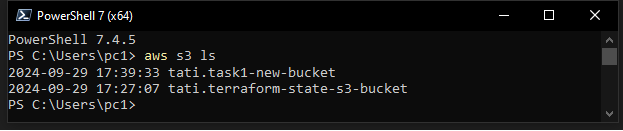

### 8. Created a GitHub Actions Workflow for Deployment via Terraform
- Developed a GitHub Actions workflow to automate the deployment process using Terraform. The workflow comprised three jobs that were triggered on pull requests and pushes to the default branch:
  - **terraform-check**: This job was responsible for format checking the Terraform code using `terraform fmt`.
  - **terraform-plan**: This job executed the `terraform plan` command to outline the changes that would be made to the infrastructure.
  - **terraform-apply**: This job deployed the Terraform configurations using `terraform apply`, applying the changes to the AWS infrastructure.
  
  This workflow streamlined the infrastructure deployment process and ensured consistent application of Terraform configurations.

  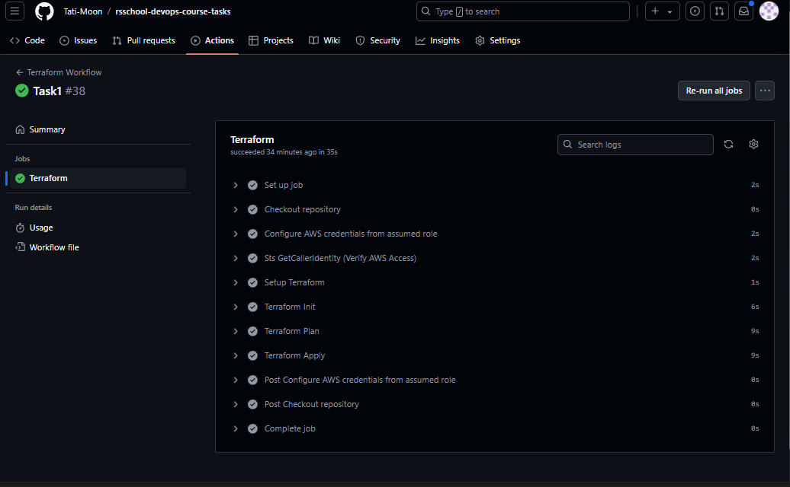

</details>

<details>
<summary>Task 2: Basic Infrastructure Configuration</summary>
https://github.com/rolling-scopes-school/tasks/blob/master/devops/modules/1_basic-configuration/task_2.md

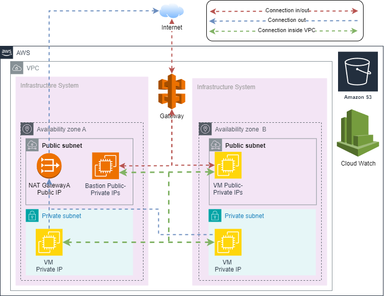

## Infrastructure Overview

This setup consists of a Virtual Private Cloud (VPC) that hosts both public and private subnets in multiple availability zones (AZs) for high availability. A NAT Gateway is deployed to allow instances in private subnets to access the internet securely, while a Bastion Host enables secure access to the private instances.

### VPC (Virtual Private Cloud)
- A VPC with the CIDR block `10.0.0.0/16`.
- Enables DNS hostnames and support.

### Subnets
- **Public Subnets**:
  - Two public subnets in different Availability Zones (`10.0.1.0/24`, `10.0.2.0/24`).
  - Automatically assigns public IP addresses to instances launched in these subnets.

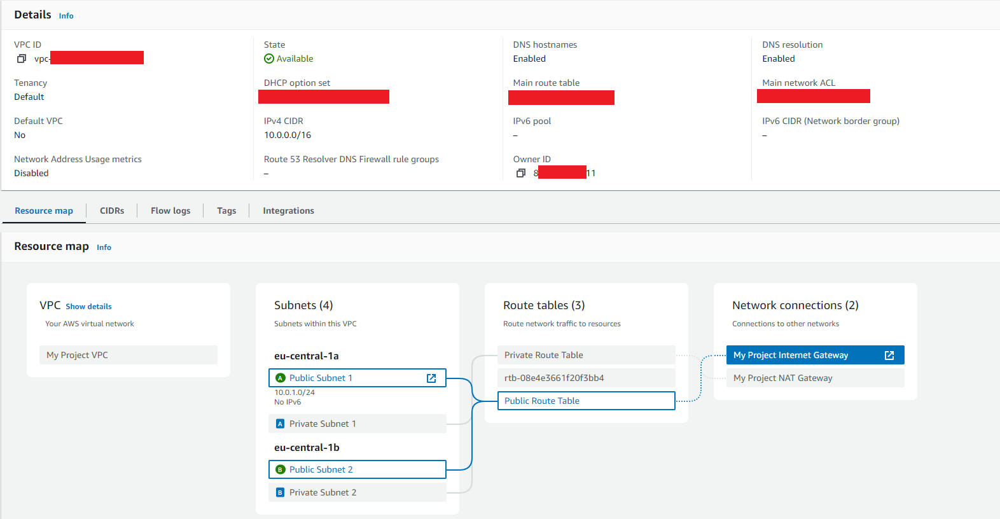

- **Private Subnets**:
  - Two private subnets in different Availability Zones (`10.0.3.0/24`, `10.0.4.0/24`).

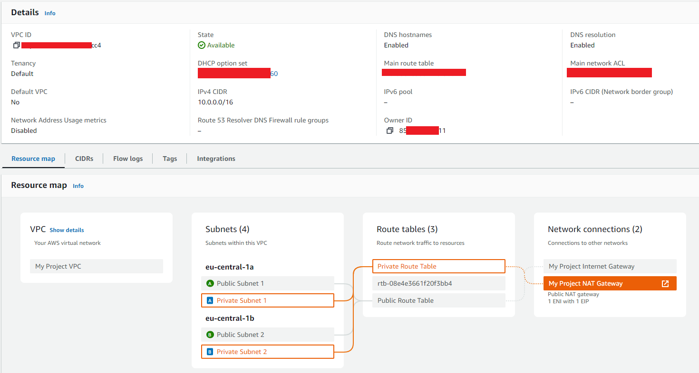

### Gateways and Routing
- **Internet Gateway**:
  - Allows communication between instances in the VPC and the Internet.
  - Attached to the VPC.

- **NAT Gateway**:
  - Enables instances in private subnets to initiate outbound traffic to the Internet.
  - Uses an Elastic IP for consistent outbound connectivity.

### Security
- **Bastion Host Security Group**:
  - Allows SSH access (port 22).
  - Allows all outbound traffic.

  Bastion Host Public IPv4 address: 18.193.108.66
Private Instance 1 Private IPv4 addresses: 10.0.3.50

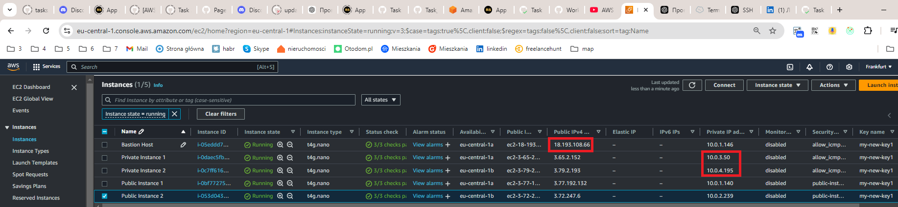

commands:
```bash
> nano key.pem
> ll
> chmod 400 key.pem
> ssh -i key.pem ec2-user@10.0.3.50
> ping www.google.com
```

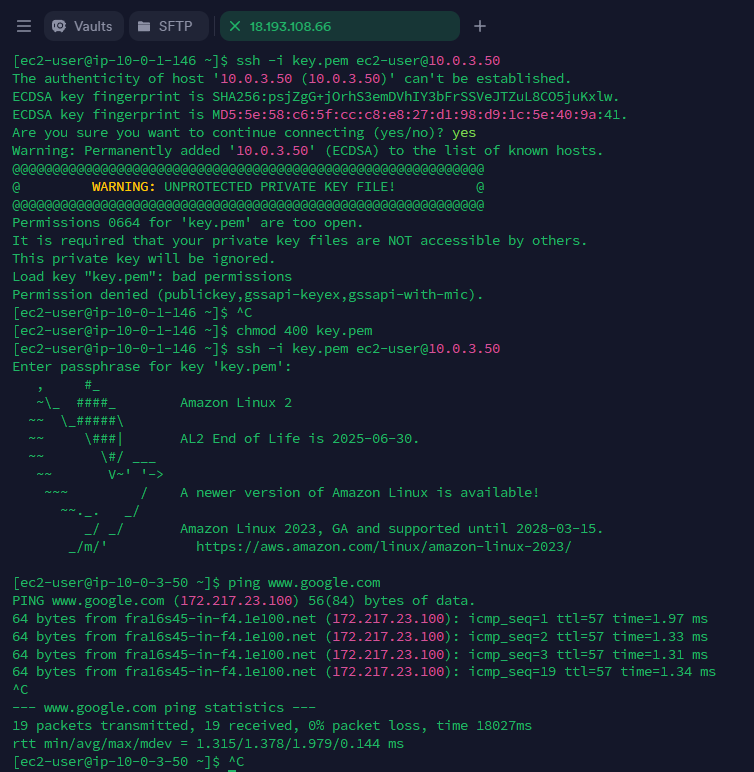

### Bastion Host
- An `t2.micro` instance serving as a bastion host in the first public subnet (`10.0.1.0/24`).
- **SSH Key**: The my-key-pair key is used for accessing the Bastion Host.

## Usage

### Prerequisites
- **Terraform CLI**: Install Terraform on your local machine.
- **AWS Credentials**: Configure AWS credentials with sufficient permissions.

## File Structure and Purpose

├── bastion_host.tf
├── gateway.tf
├── route_table.tf
├── network_acls.tf
├── output.tf
├── security_groups.tf
├── subnet.tf
├── variables.tf
└── vpc.tf

- **`bastion_host.tf`**  
  Configures an EC2 instance for the Bastion Host, which provides secure SSH access to instances in private subnets.

- **`gateway.tf`**  
  Defines the Internet Gateway and NAT Gateway for the VPC, allowing public and private subnets to communicate with the Internet.

- **`route_table.tf`**  
  Configures route tables and their associations for public and private subnets, controlling how traffic is routed within the VPC.

- **`security_groups.tf`**  
  Sets up Security Groups for the Bastion Host, public subnets, and private subnets, controlling inbound and outbound traffic at the instance level.

- **`subnet.tf`**  
  Creates public and private subnets within different availability zones, providing network segmentation in the VPC.

- **`variables.tf`**  
  Declares input variables used across the Terraform configuration, making the code flexible and reusable (e.g., VPC CIDRs, regions, SSH key, etc.).

- **`vpc.tf`**  
  Defines the VPC resource, specifying the CIDR block, DNS settings, and overall VPC configuration.

- **`network_acls.tf`**  
  Configures Network ACLs (NACLs) to control traffic at the subnet level, providing an additional layer of security beyond security groups.

### Deployment
1. Clone this repository:
   ```bash
   git clone <repository_url>
   cd <repository_directory>
   ```
2. Initialize Terraform:
  ```bash
   terraform init
   ```
3. Review Terraform plan:
  ```bash
   terraform plan
   ```
4. Apply the Terraform configuration:
  ```bash
   terraform apply
   ```
5. To destroy the infrastructure created by Terraform, run:
  ```bash
   terraform destroy
   ```

</details>

<details>
<summary>Task 3: K8s Cluster Configuration and Creation</summary>

This task aimed to create AWS infrastructure, including a Kubernetes (K8s) cluster and a bastion host, using Terraform. The project involved provisioning the cluster, deploying a simple workload, and setting up monitoring. The entire process has been documented.

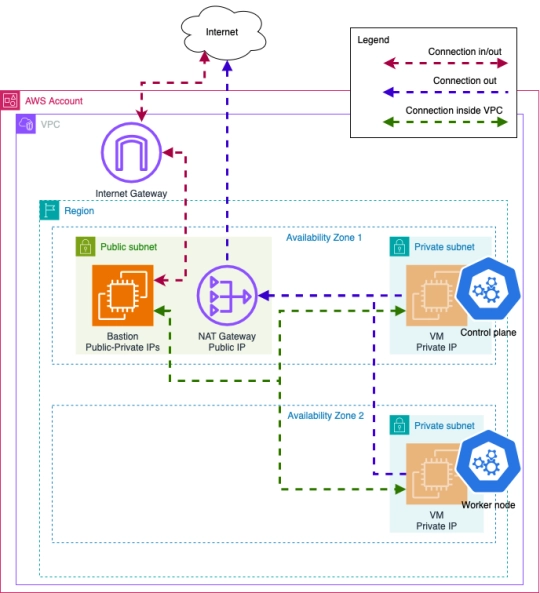

## Prerequisites

- Terraform installed
- AWS account with access keys configured
- SSH access to the bastion host
- kubectl installed on the local machine

Instances
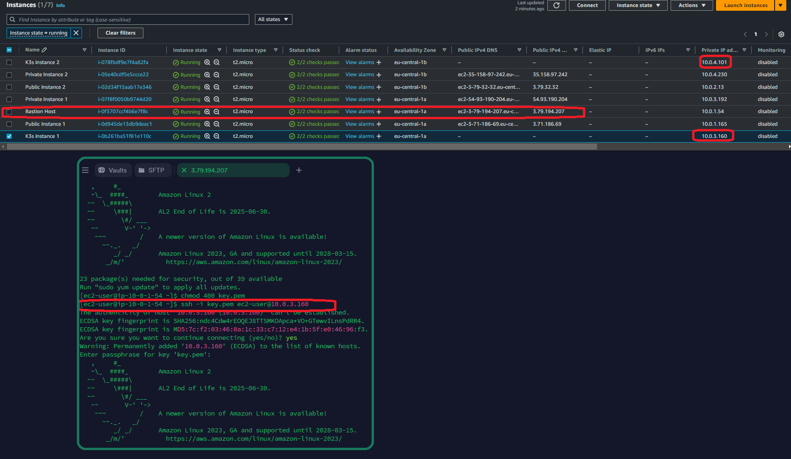

- Terraform code was developed to provision AWS resources required for the Kubernetes cluster and bastion host.
- A bastion host was created to allow secure access to the K8s cluster.
- The Kubernetes cluster was successfully deployed.
- A screenshot of the **`kubectl get nodes`** command output was provided to confirm that the cluster was running as expected.
- A simple workload was deployed to the cluster using the following command:
**`kubectl apply -f https://k8s.io/examples/pods/simple-pod.yaml`**
- It was confirmed that the workload was successfully running on the cluster.
- Monitoring tools were configured to track the cluster's performance and workloads.

commands:
```bash
> nano key.pem
> ll
> chmod 400 key.pem
> ssh -i key.pem ec2-user@10.0.3.160
> kubectl get all -n kube-system
> kubectl get nodes
> kubectl apply -f https://k8s.io/examples/pods/simple-pod.yaml
> kubectl get pods
> sudo systemctl status grafana-server
> sudo netstat -tuln | grep 3000
```

The following command was used to verify that the cluster nodes were up and running
**`kubectl get nodes`**

Nodes:
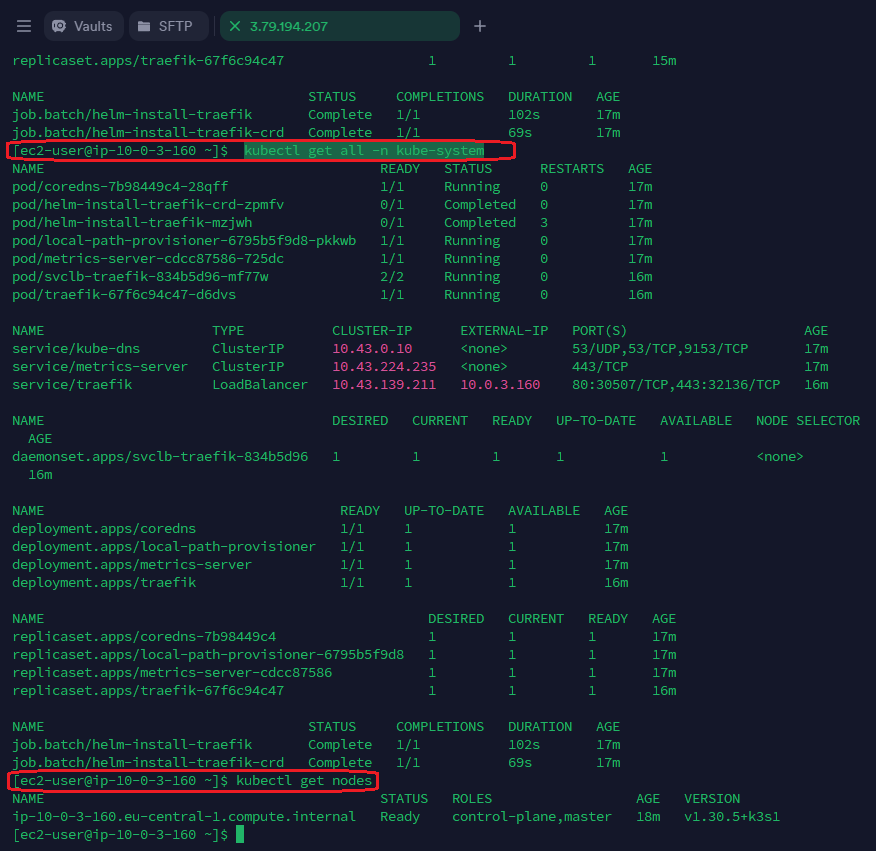

A simple pod was deployed using:
**`kubectl apply -f https://k8s.io/examples/pods/simple-pod.yaml`**
The pod's status was confirmed with:
**`kubectl get pods`**

Pods
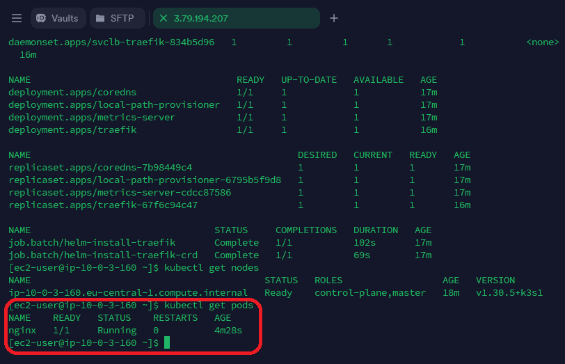

Grafana
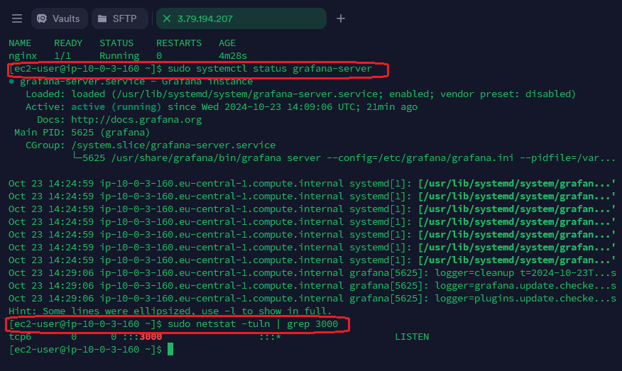

## Steps to Deploy

1. **Clone the Repository**
   ```bash
   git clone <repository-url>
   cd <repository-directory>
   ```
2. Initialize Terraform:
  ```bash
   terraform init
   ```
3. Review Terraform plan:
  ```bash
   terraform plan
   ```
4. Apply the Terraform configuration:
  ```bash
   terraform apply
   ```
5. To destroy the infrastructure created by Terraform, run:
  ```bash
   terraform destroy
   ```

</details>